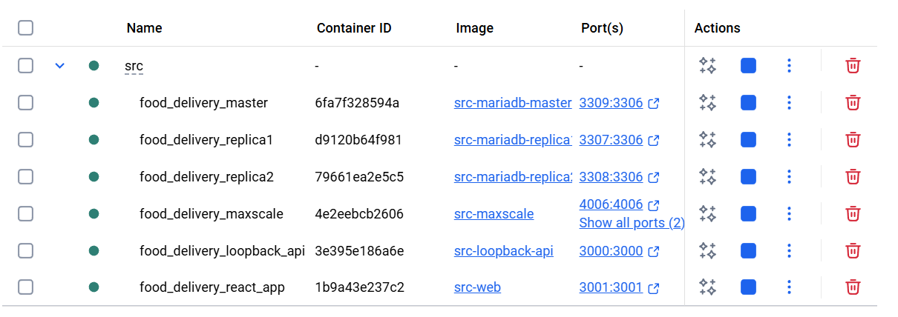
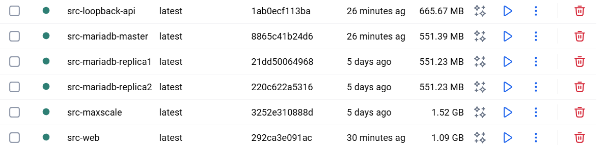
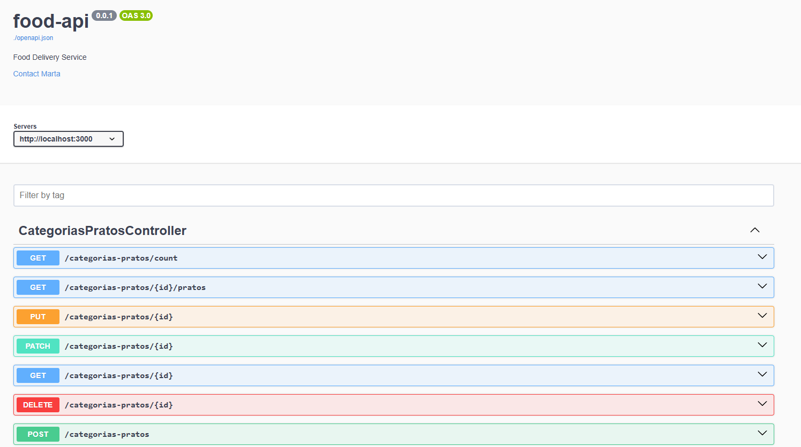
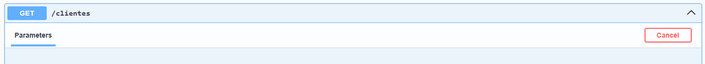
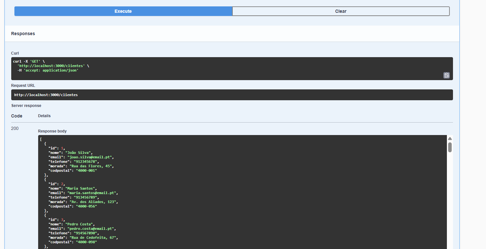
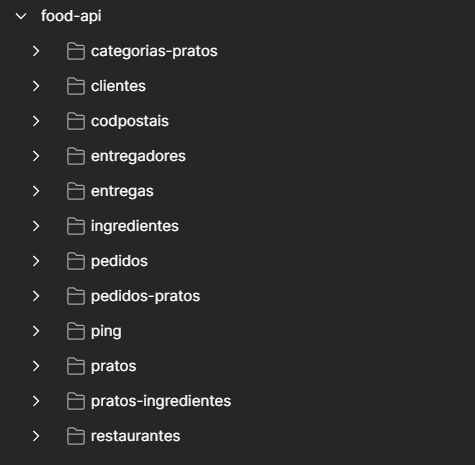
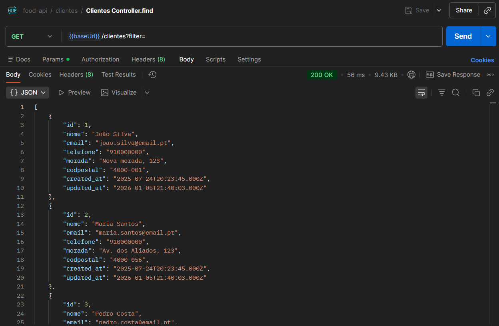

# Food Delivery API - LoopBack 4 & React Admin

Repositório usado para hospedar um projeto desenvolvido para Desenvolvimento Web I e Complementos de Base de Dados, no curso de Informática, na Univerdade da Maia.
Desenvolvido pelo grupo 13 - inf25dw1g13

* [Felipe Castilho](https://github.com/a047152) - a047152@umaia.pt
* [Juliana Moreira](https://github.com/julianaam13) - a047188@umaia.pt
* [Marta Vieira](https://github.com/xmarta19) - a046756@umaia.pt

## Descrição 

Este trabalho tem como objetivo desenvolver uma *API REST* que simula o funcionamento de uma plataforma de entregas de comida. A *API* implementa operações *CRUD* (*Create*, *Read*, *Update*, *Delete*) através dos métodos *HTTP POST*, *GET*, *PUT*, *PATCH* e *DELETE*, permitindo a gestão completa dos recursos do sistema.

O projeto foi desenvolvido seguindo uma abordagem ***Code-first***, utilizando:
- **LoopBack 4** para o desenvolvimento  da API REST
- **React Admin** para o desenvolvimento de um cliente web de backoffice

A *API* interage com uma base de dados *MariaDB* para estrutura e armazenamento de dados relacionados às entregas. O sistema inclui as seguintes entidades principais:

- **Restaurantes**: Gestão de restaurantes parceiros
- **Pratos**: Catálogo de pratos disponíveis
- **Clientes**: Gestão de clientes do sistema
- **Pedidos**: Processamento e gestão de pedidos
- **Ingredientes**: Catálogo de ingredientes utilizados
- **Entregas**: Rastreamento de entregas
- **Entregadores**: Gestão de entregadores
- **Categorias de Pratos**: Categorização dos pratos
- **Códigos Postais**: Gestão de localizações

## Links Úteis

* **Organização *GitHub*:** [inf25dw1g13](https://github.com/inf25dw1g13)  
* **Repositório do *DockerHub*:** [inf25dw1g13](https://hub.docker.com/u/inf25dw1g13)

### Arquitetura de Replicação

O sistema implementa uma arquitetura de replicação de base de dados utilizando:
- ***MariaDB Master***: Servidor principal responsável por todas as operações de escrita (*INSERT*, *UPDATE*, *DELETE*)
- ***MariaDB Replicas***: Dois servidores secundários configurados como réplicas, utilizados exclusivamente para operações de leitura (*SELECT*)
- ***MaxScale***: *Middleware* que implementa *read/write splitting*, encaminhando automaticamente:
  - Operações de escrita (*POST*, *PUT*, *PATCH*, *DELETE*) → *Master*
  - Operações de leitura (*GET*) → Réplicas (distribuindo a carga)

### Funcionalidades de Base de Dados

O projeto inclui implementações  de base de dados: 
- **Propriedades ACID**: 16 testes ACID (4 por propriedade) que validam a Atomicidade, Consistência, Isolamento e Durabilidade da base de dados
- **Sistema de Audit**: Triggers que registam todas as alterações (INSERT, UPDATE, DELETE) 
- **Alta Disponibilidade**: Auto-failover e auto-rejoin através do MaxScale

## Organização do Projeto

* **Código *Source*** está em [src](src/).
* **Capítulos do Trabalho** estão em [doc](doc/).
* **Documentação da *API* (OpenAPI/Swagger)** está disponível em: [http://localhost:3000/explorer](http://localhost:3000/explorer)
* ***Postman Collection*** está em [src/food-api.postman_collection.json](src/food-api.postman_collection.json)

## Galeria

| Descrição            | Imagem |
|----------------------|--------|
| *DockerHub*: *Containers* |  |
| *DockerHub*: *Images*     |  |
| *Swagger UI*            |  |
| *Swagger UI*: Exemplo pt.1|  |
| *Swagger UI*: Exemplo pt.2|  |
| *Postman*: Recursos     |  |
| *Postman*: Método *GET*   |  |

### Serviços Disponíveis

- **API LoopBack 4**: [http://localhost:3000](http://localhost:3000)
- **Swagger UI (Documentação)**: [http://localhost:3000/explorer](http://localhost:3000/explorer)
- **React Admin Backoffice**: [http://localhost:3001](http://localhost:3001)
- **MaxScale Dashboard**: [http://localhost:8989](http://localhost:8989)
- **MariaDB Master**: `localhost:3309`
- **MariaDB Replica 1**: `localhost:3307`
- **MariaDB Replica 2**: `localhost:3308`
- **MaxScale Router**: `localhost:4006`

## Tecnologias

### Linguagens e Formatos

* [*TypeScript*](https://www.typescriptlang.org/) - Linguagem de programação utilizada para a API
* [*JavaScript*](https://developer.mozilla.org/en-US/docs/Learn/JavaScript) - Linguagem utilizada para o frontend
* [*JSON*](https://www.json.org/) - Formato de dados para comunicação entre cliente e servidor
* [*YAML*](https://yaml.org/) - Formato utilizado para a configuração Docker

### Base de Dados

* [*MariaDB*](https://mariadb.org/) (v11.2) - Sistema de gestão de base de dados relacional
* [*MaxScale*](https://mariadb.com/products/mariadb-platform/mariadb-maxscale/) (v23.08) - *Proxy* de base de dados para *read/write splitting* e replicação

### Runtime e Servidor

* [*Node.js*](https://nodejs.org/) (v20/24) - *Runtime JavaScript* no servidor
* [*LoopBack 4*](https://loopback.io/doc/en/lb4/) - Framework para desenvolvimento expedito de APIs REST
* [*React*](https://react.dev/) (v19) - Biblioteca JavaScript para construção de interfaces
* [*React Admin*](https://marmelab.com/react-admin/) (v5) - Framework para desenvolvimento expedito de backoffice

### Containerização

* [*Docker*](https://www.docker.com/) - Plataforma de containerização
* [*Docker Compose*](https://docs.docker.com/compose/) - Orquestração de *containers multi-container*
* [*Nginx*](https://www.nginx.com/) - Servidor web para servir o React Admin em produção

### Documentação e Validação

* [*OpenAPI* 3.0](https://swagger.io/specification/) - Especificação para documentação de *APIs REST* (gerada automaticamente pelo LoopBack 4)
* [*Swagger UI*](https://swagger.io/tools/swagger-ui/) - *Interface* interativa para documentação da *API* (integrada no LoopBack 4)

## Frameworks and Libraries 

### Principais Dependências

**API (LoopBack 4):**
* `@loopback/core` - Core do LoopBack 4
* `@loopback/rest` - Framework REST
* `@loopback/repository` - Camada de repositório
* `loopback-connector-mysql` - Conector MySQL/MariaDB

**Frontend (React Admin):**
* `react-admin` - Framework de backoffice
* `react-admin-lb4` - Provider para LoopBack 4

## Report

### Apresentação do Projeto
* Chapter 1: [Apresentação do Projeto](doc/c1.md)

### Recursos
* Chapter 2: [Recursos](doc/c2.md)

### Produto
* Chapter 3: [Produto](doc/c3.md)

### Apresentação
* Chapter 4: [Apresentação](doc/c4.md)

### Base de Dados - ACID, Audit e Replicação
* Chapter 5: [Base de Dados](doc/c5.md)

## Grupo 13 - inf25dw1g13

* [Felipe Castilho](https://github.com/a047152) - a047152@umaia.pt
* [Juliana Moreira](https://github.com/julianaam13) - a047188@umaia.pt
* [Marta Vieira](https://github.com/xmarta19) - a046756@umaia.pt
