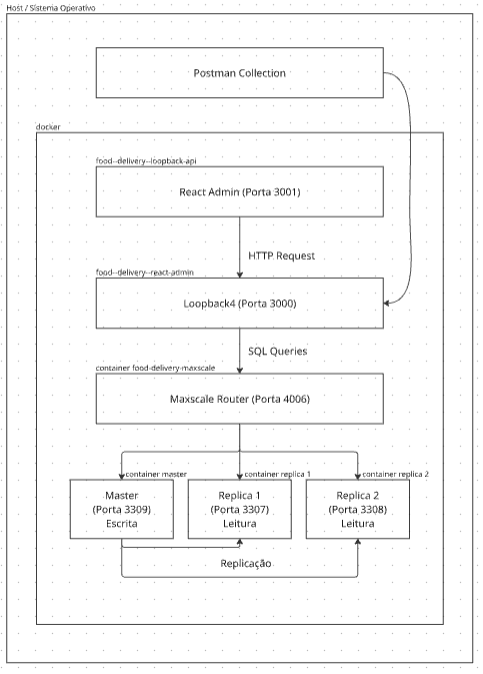
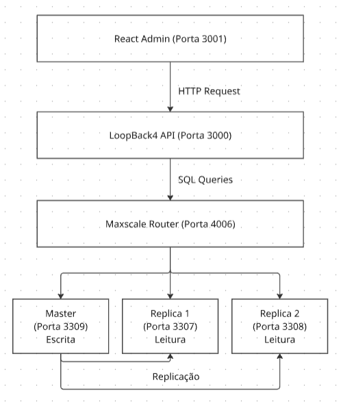

# C3 : Produto

Descrição do desenvolvimento do produto, a sua instalação e execução.

## Desenvolvimento

**Visão Geral do Projeto**

- ***DB-master*:**  
Servidor principal responsável pelas operações de escrita.

- ***DB-réplicas*:**  
Servidores secundários configurados como réplicas, para operações de leitura.

- ***MaxScale*:**  
*Proxy* e roteador que implementa o *read/write splitting*, e encaminha automaticamente os pedidos de escrita e leitura para as respetivas bases de dados.

- ***API*:**  
Serviço *Node.js* desenvolvido com *LoopBack 4* que implementa os *endpoints* da *API* e comunica com a base de dados exclusivamente através do *MaxScale*.

- ***Backoffice*:**  
Interface de administração desenvolvida com *React Admin* que permite a gestão de todos os recursos da aplicação.


**Arquitetura do Projeto:**

  

- Imagem desenhada no Miro: [Arquitetura](https://miro.com/app/board/uXjVJhjT7X0=/?share_link_id=289133236006)


**Fluxo de Dados:**

  

- Imagem desenhada no Miro: [Fluxo de Dados](https://miro.com/app/board/uXjVJi6sH_8=/?share_link_id=315844749630)  


## Estrutura do Projeto

### ***Docker-compose***

**1. Rede e Volumes**  
Rede: *food_network*  
Volumes: *master_data*, *replica1_data*, *replica2_data*  

**2. Master**  
Iniciada com os scripts de criação da base de dados e inserção dos dados iniciais.  
Executa scripts na ordem:  
- Cria utilizador para *MaxScale* (*00_maxscale_user.sql*)  
- Cria base de dados e tabelas (*01_schema.sql*)  
- Insere dados iniciais (*02_seed.sql*) 
- Cria *triggers* de *audit* (*03_audit.sql*)       

Após a inicialização, a base de dados fica acessível na porta 3309.

**3. Réplicas**   
Iniciadas nas portas 3307 e 3308, na *BD-replica* 1 e na *BD-replica2*, respetivamente.  
Cada réplica espera *Master* estar ligado para se conectar e iniciar o processo de replicação até ficarem totalmente sincronizadas.  

**4. Inicialização do MaxScale**  
Lê as configurações definidas no ficheiro *maxscale.cnf*, que cria o *monitor*.  
Estabelece ligação às três bases de dados: *Master*, *Replica1* e *Replica2*.  

**5. MariaDB Monitor**  
Verifica o estado do *Master* e das Réplicas a cada 2 segundos com *pings*. - *health check*  
Promove réplica a *Master* se *Master* cair - *auto-failover*  
Reconecta servidores que voltam *online* - *auto-rejoin*  
*Router*: *ReadWriteSplit* - *read-only enforcement*  
- *SELECTs* são encaminhados para as réplicas.  
- *INSERTs* / *UPDATEs* / *DELETEs* são enviados para o *Master*.    

*Interface* - porta 8989  
- Credenciais:  
  **user:** *admin*  
  **password:** *mariadb*  
- Permite monitorizar o estado do *Master* e das Réplicas.  

**Serviços Ativos**

- *localhost*:3000 – *LoopBack 4 API*  
- *localhost*:3001 – *React Admin Interface* (produção) ou *localhost*:3001 (desenvolvimento)  
- *localhost*:3309 – *MariaDB Master*  
- *localhost*:3307 – *MariaDB Replica* 1  
- *localhost*:3308 – *MariaDB Replica* 2  
- *localhost*:4006 – *MaxScale* (*router*)  
- *localhost*:8989 – *MaxScale Dashboard*  

**Imagem API (*LoopBack 4 Server*)**

**src/food-delivery-lb4/Dockerfile**

```dockerfile
FROM docker.io/library/node:24-slim  # Faz download da imagem base Node.js
USER node                              # Define utilizador não-root
RUN mkdir -p /home/node/app            # Cria diretório de trabalho
WORKDIR /home/node/app                 # Define o diretório de trabalho
COPY --chown=node package*.json ./     # Copia o package.json
RUN npm install                        # Instala as dependências
COPY --chown=node . .                  # Copia o resto do código
RUN npm run build                      # Compila o TypeScript
ENV HOST=0.0.0.0 PORT=3000            # Define variáveis de ambiente
EXPOSE 3000                            # Indica a porta usada pelo LoopBack
CMD ["node", "."]                     # Inicia o servidor LoopBack
```

**Imagem React Admin (*Backoffice*)**

**src/food_react_app/Dockerfile.prod** (Produção)

```dockerfile
# Multi-stage
# Stage 1: Build
FROM node:20-alpine AS builder
WORKDIR /app
COPY package*.json ./
RUN npm install --legacy-peer-deps
COPY . .
RUN npm run build

# Stage 2: Production
FROM nginx:alpine
COPY --from=builder /app/build /usr/share/nginx/html
EXPOSE 80
CMD ["nginx", "-g", "daemon off;"]
```

**src/food_react_app/Dockerfile** (Desenvolvimento)

```dockerfile
FROM node:18-alpine
WORKDIR /app
COPY package*.json ./
RUN npm install
COPY . .
EXPOSE 3001
CMD ["npm", "start"]
```  


**Imagem *mariadb-master***

**src/mariadb-master/Dockerfile**

```dockerfile
FROM mariadb:11.2                                    # Faz download da imagem base MariaDB
COPY my.cnf /etc/mysql/conf.d/                       # Aplica configurações personalizadas do servidor
COPY scripts/ /docker-entrypoint-initdb.d/           # Copia os scripts de inicialização
```  

**Scripts Executados** (em ordem de execução):  
- `00_maxscale_user.sql` - Cria o utilizador utilizado pelo *MaxScale*  
- `01_schema.sql` - Cria a base de dados e as tabelas  
- `02_seed.sql` - Insere dados iniciais na base de dados  
- `03_audit.sql` - Configura *audit* e *triggers*  


**Imagem *mariadb-replicas***

**src/mariadb-replica/Dockerfile**

```dockerfile
FROM mariadb:11.2                                      # Faz download da imagem base MariaDB
COPY my.cnf /etc/mysql/conf.d/                         # Aplica configurações personalizadas do servidor
COPY scripts/ /docker-entrypoint-initdb.d/             # Copia os scripts de inicialização

RUN chmod +x /docker-entrypoint-initdb.d/*.sh 2>/dev/null || true  
# Permite que os bash possam ser executados quando o MariaDB estiver pronto
```  

**Scripts Executados:**  
- `01_setup_replication.sh` - Configura a réplica e conecta ao *Master* para iniciar a replicação  


**Imagem *maxscale***

**src/maxscale/Dockerfile**

```dockerfile
FROM mariadb/maxscale:23.08                         # Descarrega a imagem do maxscale
COPY maxscale.cnf.ini /etc/maxscale.cnf             # Copia a configuração do servidor, monitor e routing
```             
  
Assim, o *MaxScale* liga-se ao *mariadb-master*, *mariadb-replica1*, *mariadb-replica2*. Depois Inicia o *MariaDB monitor*, ativa o *Read/Write Split Router* e cria o *listener* da *API* e o painel de administração.  


***Postman***

A *Postman Collection* está disponível em: [src/food-api.postman_collection.json](../src/food-api.postman_collection.json)

A collection inclui exemplos de todos os recursos da API:
- Restaurantes, Pratos, Clientes, Pedidos, Entregas, Ingredientes, Entregadores, Categorias de Pratos, Códigos Postais

Todos os endpoints seguem o padrão REST e podem ser testados através da collection do Postman ou através da interface Swagger UI disponível em [http://localhost:3000/explorer](http://localhost:3000/explorer).  

## Instalação

O projeto pode ser executado através do *docker-compose.dev* ou através do *docker-compose.prod*, tendo em conta que, se for executado o *docker-compose.prod*, é necessário ter *login* no *DockerHub*.  

**Pré-requisitos:**
- *Docker* e *Docker Compose* instalados
- Portas 3000, 3001, 3307, 3308, 3309, 4006 e 8989 disponíveis
- (Opcional) Conta no *DockerHub* para usar imagens de produção

***DockerHub*:**  
O projeto utiliza o repositório *DockerHub* **[inf25dw1g13](https://hub.docker.com/repositories/inf25dw1g13)** com os seguintes repositórios públicos:
- `inf25dw1g13/food-delivery-lb:latest` - Imagem da *API LoopBack 4*
- `inf25dw1g13/food-delivery-react-admin:latest` - Imagem do *React Admin Backoffice*
- `inf25dw1g13/food-delivery-mariadb-master:latest` - Imagem do *MariaDB Master*
- `inf25dw1g13/food-delivery-mariadb-replica:latest` - Imagem do *MariaDB Replica*
- `inf25dw1g13/food-delivery-maxscale:latest` - Imagem do *MaxScale*

**Instruções de instalação:**

1. Navegue até à pasta **src** do projeto:
   ```bash
   cd src
   ```

2. Execute um dos seguintes comandos:

   **Para desenvolvimento (*build* local):**
   ```bash
   docker compose -f docker-compose.dev.yaml up --build
   ```
   Este comando constrói as imagens localmente a partir dos *Dockerfiles*, incluindo a API LoopBack 4 e o backoffice React Admin.

   **Para produção (usa imagens do *DockerHub*):**
   ```bash
   docker login
   docker compose -f docker-compose.prod.yaml up
   ```
   Este comando utiliza as imagens pré-construídas do [*DockerHub*](https://hub.docker.com/repositories/inf25dw1g13), sendo necessário fazer *login* primeiro.

3. Aguarde até que todos os containers estejam em execução.

O trabalho foi desenvolvido para ser executado em ambiente *Docker*, podendo ser apresentado em qualquer máquina com *Docker* instalado. As imagens estão disponíveis no *DockerHub*.

## Uso

Após instalação e execução do *compose* (*dev* ou *prod*), a *API* e o *backoffice* ficam disponíveis em:  

- [*localhost*:3000/explorer](http://localhost:3000/explorer)  
Interface de documentação da *API* LoopBack 4 com *Swagger UI*. As respostas são devolvidas em formato *JSON*.

- [*localhost*:3000/ping](http://localhost:3000/ping)  
Endpoint para verificar o estado do servidor.

- [*localhost*:3001](http://localhost:3001)  
Interface de administração desenvolvida com *React Admin* para gestão de todos os recursos.

- [*localhost*:8989](http://localhost:8989)  
*Link* para aceder ao *MaxScale*: Monitorização (apenas replicação)
Credenciais: *username*: *admin* / *password*: *mariadb*

## Detalhes de implementação - Requisitos Obrigatórios

**Arquitetura de serviços tipo *REST*:** 

Cada recurso tem *endpoints* individuais com métodos *HTTP* específicos e respostas em *JSON*. Exemplo de implementação:

***Controller* (*RestaurantesController.ts*):**
```typescript
import {
  Count,
  CountSchema,
  Filter,
  FilterExcludingWhere,
  repository,
  Where,
} from '@loopback/repository';
import {
  post,
  param,
  get,
  getModelSchemaRef,
  patch,
  put,
  del,
  requestBody,
  response,
} from '@loopback/rest';
import {Restaurantes} from '../models';
import {RestaurantesRepository} from '../repositories';

export class RestaurantesController {
  constructor(
    @repository(RestaurantesRepository)
    public restaurantesRepository : RestaurantesRepository,
  ) {}

  @get('/restaurantes')
  @response(200, {
    description: 'Array of Restaurantes model instances',
    content: {
      'application/json': {
        schema: {
          type: 'array',
          items: getModelSchemaRef(Restaurantes, {includeRelations: true}),
        },
      },
    },
  })
  async find(
    @param.filter(Restaurantes) filter?: Filter<Restaurantes>,
  ): Promise<Restaurantes[]> {
    return this.restaurantesRepository.find(filter);
  }
}
```

**Pedido *HTTP* - *Postman***

  

**Utilização de pelo menos 4 verbos (métodos) do protocolo *HTTP* - *CRUD*:** 

Todos os métodos *HTTP* (*GET*, *POST*, *PUT*, *PATCH*, *DELETE*) foram implementados em cada recurso usando decorators do LoopBack 4. Exemplo de implementação:

```typescript
// GET - Listar recursos
@get('/restaurantes')
@response(200, {
  description: 'Array of Restaurantes model instances',
  content: {
    'application/json': {
      schema: {
        type: 'array',
        items: getModelSchemaRef(Restaurantes, {includeRelations: true}),
      },
    },
  },
})
async find(
  @param.filter(Restaurantes) filter?: Filter<Restaurantes>,
): Promise<Restaurantes[]> {
  return this.restaurantesRepository.find(filter);
}

// POST - Criar recurso
@post('/restaurantes')
@response(200, {
  description: 'Restaurantes model instance',
  content: {'application/json': {schema: getModelSchemaRef(Restaurantes)}},
})
async create(
  @requestBody({
    content: {
      'application/json': {
        schema: getModelSchemaRef(Restaurantes, {
          title: 'NewRestaurantes',
          exclude: ['id'],
        }),
      },
    },
  }) restaurantes: Omit<Restaurantes, 'id'>,
): Promise<Restaurantes> {
  return this.restaurantesRepository.create(restaurantes);
}

// PATCH - Atualizar parcialmente recurso
@patch('/restaurantes/{id}')
@response(204, {
  description: 'Restaurantes PATCH success',
})
async updateById(
  @param.path.number('id') id: number,
  @requestBody({
    content: {
      'application/json': {
        schema: getModelSchemaRef(Restaurantes, {partial: true}),
      },
    },
  })
  restaurantes: Restaurantes,
): Promise<void> {
  await this.restaurantesRepository.updateById(id, restaurantes);
}

// PUT - Substituir completamente recurso
@put('/restaurantes/{id}')
@response(204, {
  description: 'Restaurantes PUT success',
})
async replaceById(
  @param.path.number('id') id: number,
  @requestBody({
    content: {
      'application/json': {
        schema: getModelSchemaRef(Restaurantes),
      },
    },
  })
  restaurantes: Restaurantes,
): Promise<void> {
  await this.restaurantesRepository.replaceById(id, restaurantes);
}

// DELETE - Apagar recurso
@del('/restaurantes/{id}')
@response(204, {
  description: 'Restaurantes DELETE success',
})
async deleteById(@param.path.number('id') id: number): Promise<void> {
  await this.restaurantesRepository.deleteById(id);
}
```

***Interface* no *Swagger***

   

**Disponibilizar pelo menos 4 recursos diferentes:** 
- este projeto apresenta 9 recursos: Restaurantes, Pratos, Clientes, Ingredientes, Entregas, Pedidos, Entregadores, Categorias de Pratos e Códigos Postais.  

   

**Utilização de pelo menos uma relação de cardinalidade 1:n entre dois dos recursos:**

O projeto implementa várias relações 1:n usando os decorators do LoopBack 4. Exemplo de código:

**Relação Restaurantes -> Pratos (*Restaurantes.model.ts*):**
```typescript
@model({
  settings: {
    mysql: {
      table: 'restaurantes'
    }
  }
})
export class Restaurantes extends Entity {

  @hasMany(() => Pratos, {keyTo: 'restaurante_id'})
  pratos: Pratos[];

  @hasMany(() => Pedidos, {keyTo: 'restaurante_id'})
  pedidos: Pedidos[];

  @hasMany(() => Entregas, {keyTo: 'restaurante_id'})
  entregas: Entregas[];
}
```

**Relações implementadas:**
- `restaurantes -> pratos`: Um restaurante tem muitos pratos
- `restaurantes -> pedidos`: Um restaurante recebe muitos pedidos
- `restaurantes -> entregas`: Um restaurante faz muitas entregas
- `clientes -> pedidos`: Um cliente pode ter muitos pedidos
- `entregadores -> entregas`: Um entregador faz muitas entregas
- `categorias -> pratos`: Uma categoria tem muitos pratos
- `codpostais -> clientes/restaurantes/entregadores`: Um código postal pode ter múltiplos registos

**Disponibilização das representações de estado dos recursos em *JSON*:**  

Todos os recursos retornam dados em formato *JSON*. Exemplo de resposta:

```json
{
  "id": 1,
  "nome": "Pizzaria Bella Napoli",
  "morada": "Rua das Flores, 123",
  "codpostal": "4000-001",
  "email": "bella@napoli.pt",
  "telefone": "223456789",
  "especialidade_id": 1,
  "hora_abertura": "12:00:00",
  "hora_fecho": "23:00:00",
  "estado": "aberto",
  "descricao": "Pizzas napolitanas autênticas em forno a lenha",
  "taxa_entrega": 2.99,
  "created_at": "2026-01-01T10:00:00.000Z"
}
```

A implementação garante que todas as respostas são em *JSON* através da configuração do LoopBack 4, que utiliza *JSON* como formato padrão para todas as respostas REST.


  

**Documentar a *API* com recurso ao formato *OpenAPI* 3.0:** 

A *API* foi desenvolvida com *LoopBack 4* que gera automaticamente a documentação *OpenAPI* 3.0 a partir do código-fonte.  

**Implementação:**
- A especificação *OpenAPI* 3.0 é gerada automaticamente pelo LoopBack 4
- A documentação interativa está disponível em: [http://localhost:3000/explorer](http://localhost:3000/explorer)
- A especificação em formato JSON está disponível em: [http://localhost:3000/openapi.json](http://localhost:3000/openapi.json)

**Disponibilizar uma *Collection* para o *Postman* para consulta dos recursos:** 
- Foi criada e disponibilizada uma *Postman Collection* para consultar os recursos:
- O ficheiro está localizado em: [src/food-api.postman_collection.json](../src/food-api.postman_collection.json)
- Pode ser importado diretamente no *Postman* para testar todos os *endpoints* da *API*

**Utilização do *MySQL* como *SGBD*:** 
- foi utilizado o *MariaDB* versão 11.2 como base de dados, com autorização prévia do docente
- A configuração do *MariaDB Master* está em: [src/mariadb-master](../src/mariadb-master/)
- A configuração das réplicas está em: [src/mariadb-replica](../src/mariadb-replica/)
- Mais informações sobre *MariaDB*: [https://mariadb.org/](https://mariadb.org/)

**Utilização do *Node.js* como servidor aplicacional para implementação da camada de serviços:** 

A *API* foi desenvolvida com *Node.js* versão 20 e *LoopBack 4*, utilizando arquitetura baseada em *decorators* e *repositories*.

**Estrutura do Servidor (*application.ts*):**
```typescript
import {BootMixin} from '@loopback/boot';
import {ApplicationConfig} from '@loopback/core';
import {RestExplorerBindings, RestExplorerComponent} from '@loopback/rest-explorer';
import {RepositoryMixin} from '@loopback/repository';
import {RestApplication} from '@loopback/rest';
import {ServiceMixin} from '@loopback/service-proxy';
import path from 'path';
import {MySequence} from './sequence';

export class FoodApiApplication extends BootMixin(
  ServiceMixin(RepositoryMixin(RestApplication)),
) {
  constructor(options: ApplicationConfig = {}) {
    super(options);

    this.sequence(MySequence);

    this.static('/', path.join(__dirname, '../public'));

    this.configure(RestExplorerBindings.COMPONENT).to({
      path: '/explorer',
    });
    this.component(RestExplorerComponent);

    this.projectRoot = __dirname;

    this.bootOptions = {
      controllers: {

        dirs: ['controllers'],
        extensions: ['.controller.js'],
        nested: true,
      },
    };
  }
}
```

**Conexão à Base de Dados (*datasources/fooddelivery.datasource.ts*):**
```typescript
import {inject, lifeCycleObserver, LifeCycleObserver} from '@loopback/core';
import {juggler} from '@loopback/repository';

const config = {
  name: 'food_delivery',
  connector: 'mysql',
  url: '',
  host: process.env.DB_HOST || 'localhost',
  port: process.env.DB_PORT ? Number(process.env.DB_PORT) : 3306,
  user: process.env.DB_USER || 'api_user',
  password: process.env.DB_PASSWORD || 'api_password',
  database: process.env.DB_NAME || 'food_delivery'
};

@lifeCycleObserver('datasource')
export class FoodDeliveryDataSource extends juggler.DataSource
  implements LifeCycleObserver {
  static dataSourceName = 'food_delivery';
  static readonly defaultConfig = config;

  constructor(
    @inject('datasources.config.food_delivery', {optional: true})
    dsConfig: object = config,
  ) {
    super(dsConfig);
  }
}
```

**Arquitetura:**
- ***Controllers*** (`controllers/`) - Definem os *endpoints* da *API* usando *decorators*
- ***Models*** (`models/`) - Definem a estrutura dos dados e relações
- ***Repositories*** (`repositories/`) - Implementam operações de acesso à base de dados
- ***Datasources*** (`datasources/`) - Configuram a conexão à base de dados

O código do servidor está em: [src/food-delivery-lb4](../src/food-delivery-lb4/)  
O código do backoffice está em: [src/food_react_app](../src/food_react_app/)  
Mais informações: [*Node.js*](https://nodejs.org/) | [*LoopBack 4*](https://loopback.io/doc/en/lb4/) | [*React Admin*](https://marmelab.com/react-admin/)

**Disponibilização de configuração para a aplicação *multi-container* (pelo menos 2 imagens) *MySQL* + *NodeJS*:** 
- foram utilizadas 6 imagens para os *containers*:
  - 1 para a *API LoopBack 4*
  - 1 para o *React Admin Backoffice*
  - 1 para *MariaDB master* (principal)
  - 2 para as réplicas da *MariaDB master*
  - 1 para o *MaxScale* (que conecta a base de dados da *MariaDB* para a *API*)

  

  

### Requisitos Extra

**Filtros através de parâmetros *HTTP*:**  

A *API* suporta filtros através de *query parameters* usando os recursos avançados do LoopBack 4:

**Exemplo - *Controller* (*RestaurantesController.ts*):**
```typescript
@get('/restaurantes')
@response(200, {
  description: 'Array of Restaurantes model instances',
  content: {
    'application/json': {
      schema: {
        type: 'array',
        items: getModelSchemaRef(Restaurantes, {includeRelations: true}),
      },
    },
  },
})
async find(
  @param.filter(Restaurantes) filter?: Filter<Restaurantes>,
): Promise<Restaurantes[]> {
  return this.restaurantesRepository.find(filter);
}
```

**Filtros disponíveis (usando sintaxe LoopBack 4):**
- `GET /restaurantes?filter[where][estado]=aberto` - Filtrar restaurantes por estado
- `GET /pratos?filter[where][disponivel]=true` - Filtrar pratos disponíveis
- `GET /pratos?filter[where][vegetariano]=true` - Filtrar pratos vegetarianos
- `GET /pedidos?filter[where][cliente_id]=1` - Filtrar pedidos por cliente
- `GET /ingredientes?filter[where][alergeno]=true` - Filtrar ingredientes alergénios
- `GET /entregas?filter[where][estado]=pendente` - Filtrar entregas por estado
- `GET /entregadores?filter[where][estado]=disponivel` - Filtrar entregadores disponíveis

**Exemplos de filtros avançados:**
- `GET /pratos?filter[where][and][0][restaurante_id]=1&filter[where][and][1][vegetariano]=true` - Pratos vegetarianos de um restaurante
- `GET /pedidos?filter[order]=hora_pedido DESC&filter[limit]=10` - Últimos 10 pedidos ordenados por data de pedido

**Filtros no React Admin:**

O *backoffice* desenvolvido com *React Admin* também implementa filtros para facilitar a pesquisa e gestão dos recursos. Exemplo de implementação de filtros:

**Exemplo - Filtros em Códigos Postais (*CodpostaisList.js*):**
```javascript
import {
    List,
    Datagrid,
    TextField,
    Filter,
    TextInput
} from 'react-admin';

const CodpostalFilter = (props) => (
    <Filter {...props}>
        <TextInput source="codpostal" label="Código Postal" alwaysOn />
        <TextInput source="localidade" label="Localidade" />
        <TextInput source="cidade" label="Cidade" />
    </Filter>
);

export const CodpostaisList = (props) => (
    <List {...props} filters={<CodpostalFilter />}>
        <Datagrid rowClick="show">
            <TextField source="codpostal" label="Código Postal" />
            <TextField source="localidade" label="Localidade" />
            <TextField source="cidade" label="Cidade" />
        </Datagrid>
    </List>
);
```

Este exemplo mostra como os filtros são implementados no *React Admin* para o recurso de códigos postais, permitindo filtrar por código postal (sempre visível), localidade e cidade.
   
**Utilização de relação de cardinalidade m:n entre dois dos recursos:**

A *API* implementa relações muitos-para-muitos através de tabelas intermediárias:

**Relação pratos <-> ingredientes:**

A relação é implementada através da tabela `pratos_ingredientes` e dos *decorators* do LoopBack 4. Exemplo de código:

**Modelo Pratos (*Pratos.model.ts*):**
```typescript
@model({
  settings: {
    mysql: {
      table: 'pratos'
    }
  }
})
export class Pratos extends Entity {

  @hasMany(() => Ingredientes, {through: {model: () => PratosIngredientes}})
  ingredientes: Ingredientes[];
}
```

**Modelo PratosIngredientes (*PratosIngredientes.model.ts*):**
```typescript
@model({
  settings: {
    mysql: {
      table: 'pratos_ingredientes'
    }
  }
})
export class PratosIngredientes extends Entity {
  @belongsTo(() => Pratos, {}, {mysql: {columnName: 'prato_id'}})
  pratosId: number;

  @belongsTo(() => Ingredientes, {}, {mysql: {columnName: 'ingrediente_id'}})
  ingredientesId: number;

  @property({type: 'string', default: '0'})
  quantidade?: string;
}
```

**Relação pedidos <-> pratos:**

Similarmente, a relação entre pedidos e pratos é implementada através da tabela `pedidos_pratos`:

**Modelo Pedidos (*Pedidos.model.ts*):**
```typescript
@hasMany(() => Pratos, {through: {model: () => PedidosPratos}})
pratos: Pratos[];
```

***Endpoints* disponíveis:**
- `GET /pratos/{id}/ingredientes` - Listar ingredientes de um prato
- `POST /pratos/{id}/ingredientes` - Adicionar ingrediente a um prato
- `PATCH /pratos/{id}/ingredientes` - Atualizar ingredientes de um prato
- `DELETE /pratos/{id}/ingredientes` - Remover ingrediente de um prato
- `GET /ingredientes/{id}/pratos` - Listar pratos que contêm um ingrediente
- `GET /pedidos/{id}/pratos` - Listar pratos de um pedido
- `POST /pedidos/{id}/pratos` - Adicionar prato a um pedido
- `PATCH /pedidos/{id}/pratos` - Atualizar pratos de um pedido
- `DELETE /pedidos/{id}/pratos` - Remover prato de um pedido

**Exemplos Práticos de Utilização:**

**1. Obter todos os pratos de um pedido:**
```http
GET /pedidos/1/pratos HTTP/1.1
Host: localhost:3000
```

**2. Adicionar um prato a um pedido (cria o prato e a relação automaticamente):**
```http
POST /pedidos/1/pratos HTTP/1.1
Host: localhost:3000
Content-Type: application/json

{
  "restaurante_id": 1,
  "categoria_id": 1,
  "nome": "Pizza Margherita",
  "preco": 850,
  "descricao": "Molho de tomate, mozzarella e manjericão",
  "disponivel": true,
  "vegetariano": true,
  "vegan": false,
  "sem_gluten": false
}
```

**3. Adicionar relação entre pedido existente e prato existente (através da tabela intermediária):**
```http
POST /pedidos-pratos HTTP/1.1
Host: localhost:3000
Content-Type: application/json

{
  "pedidosId": 1,
  "pratosId": 5,
  "quantidade": 2
}
```

**4. Remover pratos de um pedido:**
```http
DELETE /pedidos/1/pratos?where[id]=5 HTTP/1.1
Host: localhost:3000
```

**5. Adicionar um ingrediente a um prato:**
```http
POST /pratos/1/ingredientes HTTP/1.1
Host: localhost:3000
Content-Type: application/json

{
  "nome": "Manjericão",
  "tipo": "vegetal",
  "alergeno": false
}
```

---
[< Previous](c2.md) | [^ Main](../../../) | [Next >](c4.md)
:--- | :---: | ---: 


